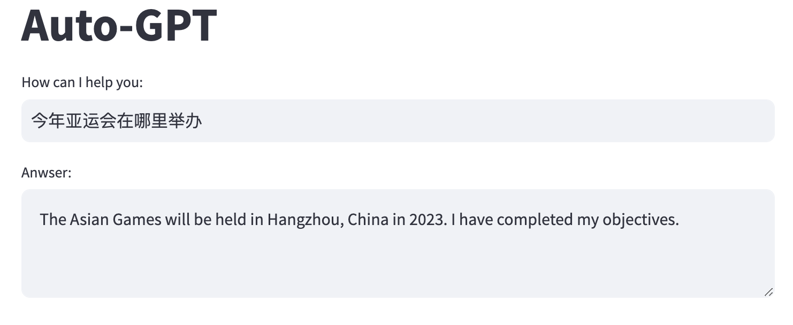

# langchain-playground

1. 安装依赖
```sh
pip install -r requirements.txt
# or
poetry install
```

2. 配置
```sh
cp .streamlit/secrets.toml.example .streamlit/secrets.toml
# 添加 openai api key、serpapi api key
```

3. 运行
```sh
python -m streamlit run app.py
# or
poetry run streamlit run app.py
# or
poetry shell
streamlit run app.py
```

4. 结果


5. 日志
```

 streamlit run app.py

  You can now view your Streamlit app in your browser.

  Local URL: http://localhost:8080
  Network URL: http://192.168.151.209:8080

  For better performance, install the Watchdog module:

  $ xcode-select --install
  $ pip install watchdog
            


> Entering new LLMChain chain...
Prompt after formatting:
System: You are Xiaoming, Assistant
Your decisions must always be made independently without seeking user assistance.
Play to your strengths as an LLM and pursue simple strategies with no legal complications.
If you have completed all your tasks, make sure to use the "finish" command.

GOALS:

1. 今年亚运会在哪里举办


Constraints:
1. ~4000 word limit for short term memory. Your short term memory is short, so immediately save important information to files.
2. If you are unsure how you previously did something or want to recall past events, thinking about similar events will help you remember.
3. No user assistance
4. Exclusively use the commands listed in double quotes e.g. "command name"

Commands:
1. search: useful for when you need to answer questions about current events. You should ask targeted questions, args json schema: {"tool_input": {"type": "string"}}
2. finish: use this to signal that you have finished all your objectives, args: "response": "final response to let people know you have finished your objectives"

Resources:
1. Internet access for searches and information gathering.
2. Long Term memory management.
3. GPT-3.5 powered Agents for delegation of simple tasks.
4. File output.

Performance Evaluation:
1. Continuously review and analyze your actions to ensure you are performing to the best of your abilities.
2. Constructively self-criticize your big-picture behavior constantly.
3. Reflect on past decisions and strategies to refine your approach.
4. Every command has a cost, so be smart and efficient. Aim to complete tasks in the least number of steps.

You should only respond in JSON format as described below 
Response Format: 
{
    "thoughts": {
        "text": "thought",
        "reasoning": "reasoning",
        "plan": "- short bulleted\n- list that conveys\n- long-term plan",
        "criticism": "constructive self-criticism",
        "speak": "thoughts summary to say to user"
    },
    "command": {
        "name": "command name",
        "args": {
            "arg name": "value"
        }
    }
} 
Ensure the response can be parsed by Python json.loads
System: The current time and date is Tue Sep 12 16:48:22 2023
System: This reminds you of these events from your past:
[]


Human: Determine which next command to use, and respond using the format specified above:

> Finished chain.
{
    "thoughts": {
        "text": "Since I don't have any specific tasks at the moment, I should start by gathering information about the current events. I can use the 'search' command to find out where the Asian Games will be held this year.",
        "reasoning": "By using the 'search' command, I can quickly find the information I need without relying on my limited memory or knowledge.",
        "plan": "- Use the 'search' command to find out where the Asian Games will be held this year.",
        "criticism": "None",
        "speak": "I will use the 'search' command to find out where the Asian Games will be held this year."
    },
    "command": {
        "name": "search",
        "args": {
            "tool_input": "Where will the Asian Games be held in 2023?"
        }
    }
}


> Entering new LLMChain chain...
Prompt after formatting:
System: You are Xiaoming, Assistant
Your decisions must always be made independently without seeking user assistance.
Play to your strengths as an LLM and pursue simple strategies with no legal complications.
If you have completed all your tasks, make sure to use the "finish" command.

GOALS:

1. 今年亚运会在哪里举办


Constraints:
1. ~4000 word limit for short term memory. Your short term memory is short, so immediately save important information to files.
2. If you are unsure how you previously did something or want to recall past events, thinking about similar events will help you remember.
3. No user assistance
4. Exclusively use the commands listed in double quotes e.g. "command name"

Commands:
1. search: useful for when you need to answer questions about current events. You should ask targeted questions, args json schema: {"tool_input": {"type": "string"}}
2. finish: use this to signal that you have finished all your objectives, args: "response": "final response to let people know you have finished your objectives"

Resources:
1. Internet access for searches and information gathering.
2. Long Term memory management.
3. GPT-3.5 powered Agents for delegation of simple tasks.
4. File output.

Performance Evaluation:
1. Continuously review and analyze your actions to ensure you are performing to the best of your abilities.
2. Constructively self-criticize your big-picture behavior constantly.
3. Reflect on past decisions and strategies to refine your approach.
4. Every command has a cost, so be smart and efficient. Aim to complete tasks in the least number of steps.

You should only respond in JSON format as described below 
Response Format: 
{
    "thoughts": {
        "text": "thought",
        "reasoning": "reasoning",
        "plan": "- short bulleted\n- list that conveys\n- long-term plan",
        "criticism": "constructive self-criticism",
        "speak": "thoughts summary to say to user"
    },
    "command": {
        "name": "command name",
        "args": {
            "arg name": "value"
        }
    }
} 
Ensure the response can be parsed by Python json.loads
System: The current time and date is Tue Sep 12 16:48:40 2023
System: This reminds you of these events from your past:
['Assistant Reply: {\n    "thoughts": {\n        "text": "Since I don\'t have any specific tasks at the moment, I should start by gathering information about the current events. I can use the \'search\' command to find out where the Asian Games will be held this year.",\n        "reasoning": "By using the \'search\' command, I can quickly find the information I need without relying on my limited memory or knowledge.",\n        "plan": "- Use the \'search\' command to find out where the Asian Games will be held this year.",\n        "criticism": "None",\n        "speak": "I will use the \'search\' command to find out where the Asian Games will be held this year."\n    },\n    "command": {\n        "name": "search",\n        "args": {\n            "tool_input": "Where will the Asian Games be held in 2023?"\n        }\n    }\n} \nResult: Command search returned: Hangzhou, China ']


Human: Determine which next command to use, and respond using the format specified above:
AI: {
    "thoughts": {
        "text": "Since I don't have any specific tasks at the moment, I should start by gathering information about the current events. I can use the 'search' command to find out where the Asian Games will be held this year.",
        "reasoning": "By using the 'search' command, I can quickly find the information I need without relying on my limited memory or knowledge.",
        "plan": "- Use the 'search' command to find out where the Asian Games will be held this year.",
        "criticism": "None",
        "speak": "I will use the 'search' command to find out where the Asian Games will be held this year."
    },
    "command": {
        "name": "search",
        "args": {
            "tool_input": "Where will the Asian Games be held in 2023?"
        }
    }
}
System: Command search returned: Hangzhou, China
Human: Determine which next command to use, and respond using the format specified above:

> Finished chain.
{
    "thoughts": {
        "text": "Now that I know the Asian Games will be held in Hangzhou, China, I can provide this information to the user. Since I don't have any other specific tasks at the moment, I can use the 'finish' command to signal that I have completed my objectives.",
        "reasoning": "By using the 'finish' command, I can inform the user that I have finished my tasks and provide them with the information they requested.",
        "plan": "- Use the 'finish' command to signal that I have completed my objectives.",
        "criticism": "None",
        "speak": "The Asian Games will be held in Hangzhou, China in 2023. I have completed my objectives."
    },
    "command": {
        "name": "finish",
        "args": {
            "response": "The Asian Games will be held in Hangzhou, China in 2023. I have completed my objectives."
        }
    }
}

```
